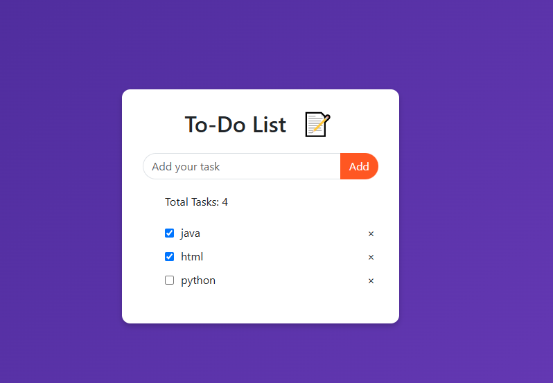

# 📝 ToDo-List

A simple and intuitive web application to manage your daily tasks efficiently.

 <!-- Replace with the actual path to your screenshot -->

## 🌐 Live Demo

Experience the application here: [ToDo-List](https://gulzaralice1.github.io/ToDo-List/)

## ✨ Features

- ➕ **Add Tasks**: Easily add new tasks to your list.
- ✅ **Mark as Completed**: Check off tasks once they're done.
- ❌ **Delete Tasks**: Remove tasks that are no longer needed.
- 📋 **Task Counter**: Keep track of the total number of tasks.
- 💾 **Local Storage**: Saves your tasks between sessions.

## 🚀 Getting Started

### Prerequisites

Ensure you have a modern web browser installed.

### Installation

1. **Clone the repository**:

   ```bash
   git clone https://github.com/Gulzaralice1/ToDo-List.git


